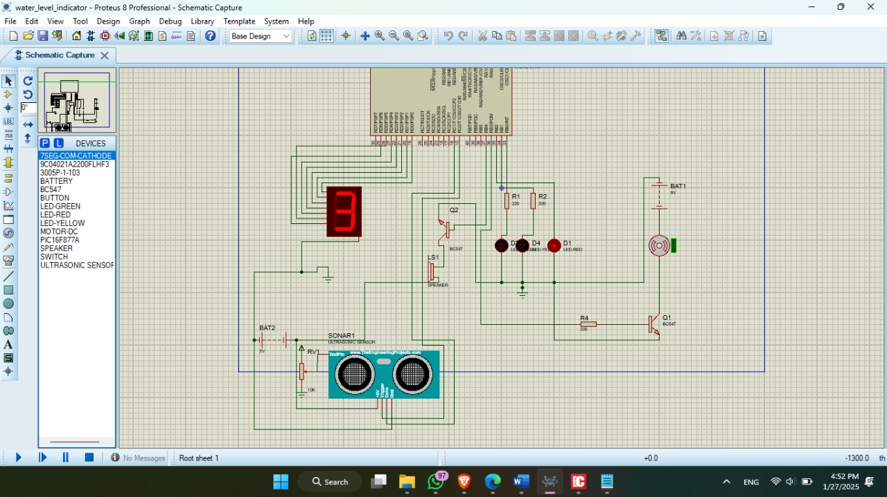
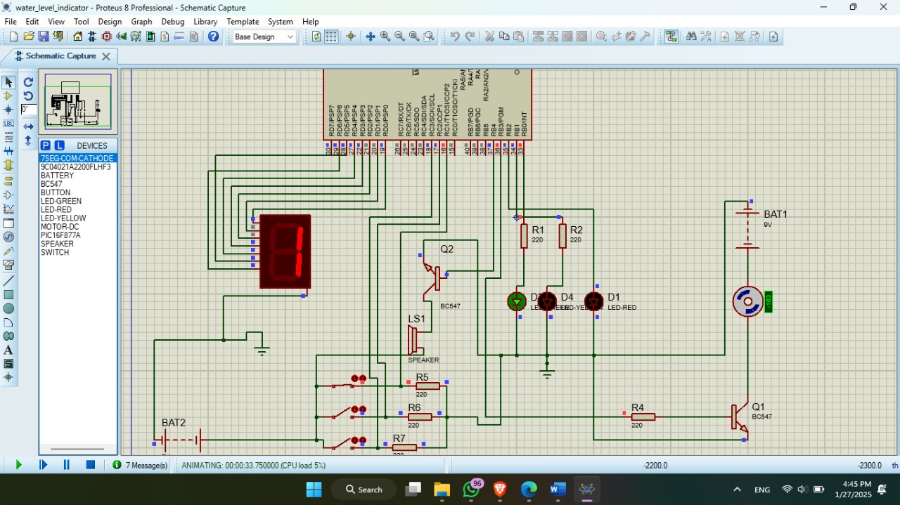
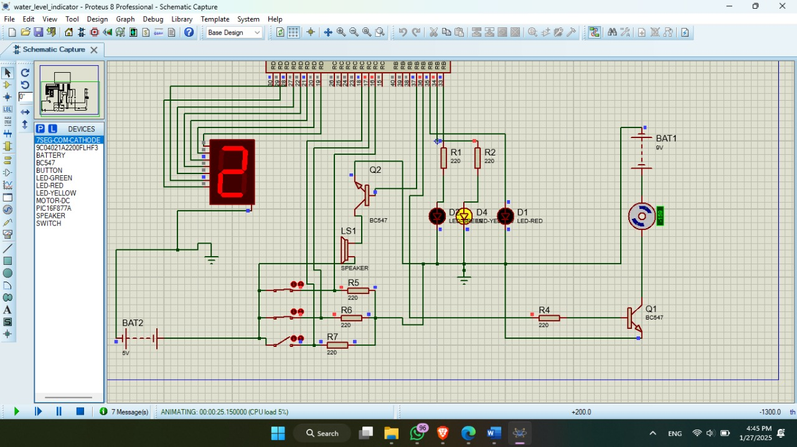
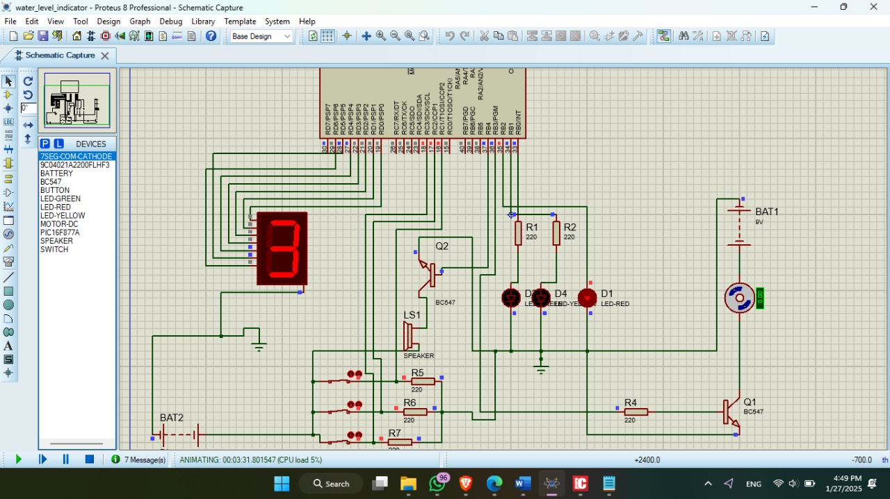
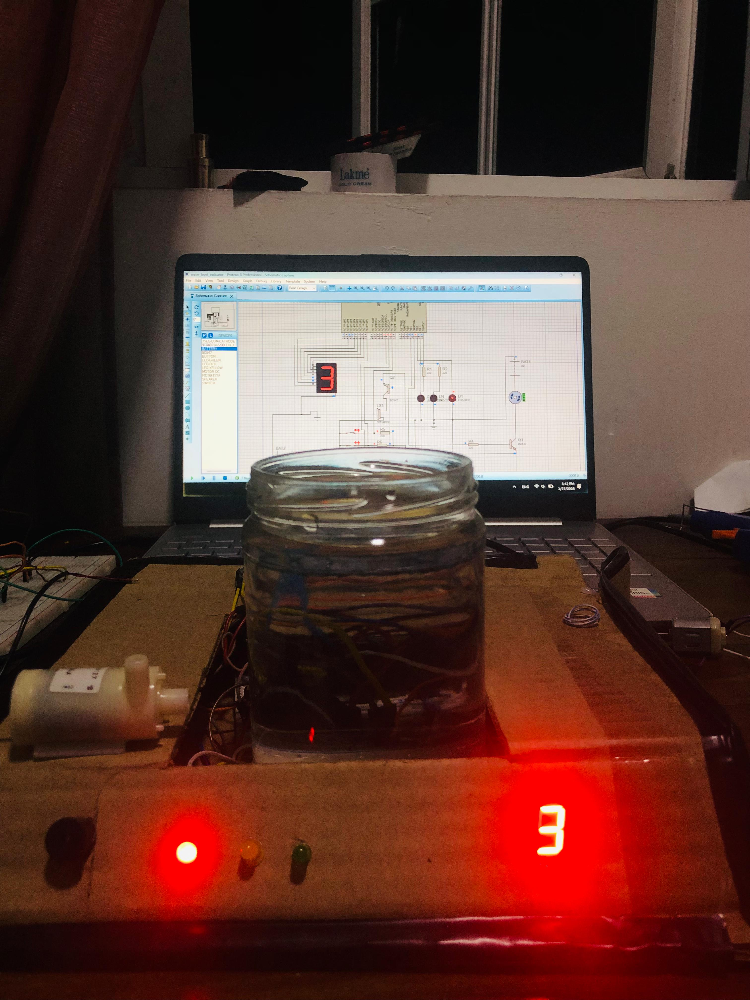
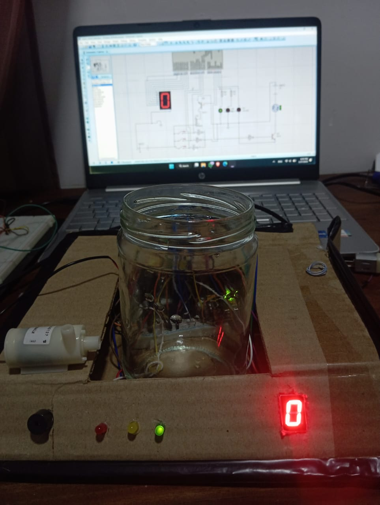
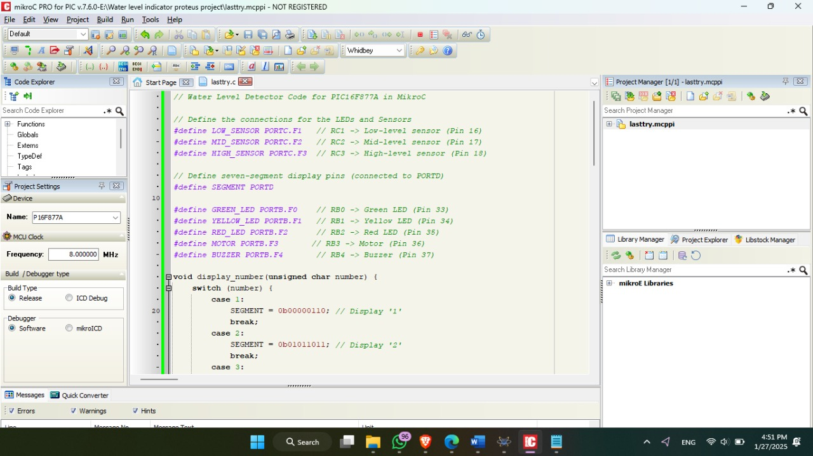

### water Level Indicator Project by using PIC16F877

## Real World Problem 

- Homes with rooftop tanks must ensure that water levels are properly controlled to prevent waste, conserve energy, and extend pump life. This system automates water tank management by combining manual control with automated safety features. It employs a timed technique to account for sensor failures and an infrared sensor to detect when the tank is full. Clear feedback is provided by an LCD display, buzzers, and LEDs. When the tank is full or after 12 minutes of operation, the motor turns off automatically. It is manually started. This hybrid approach ensures reliability, minimizes sensor errors, and optimizes water use.

## Proposed Solution 
During the initial stages of development, we implemented the system using Proteus. However, as we progressed, we encountered several real-time challenges that required us to rethink our approach:
# Using Electrical Current to Measure Water Levels

- First approach involved attempting to measure the water level by passing electrical current through the water. The idea was that the water's conductivity would help determine the level. However, this method proved ineffective, as the current did not behave in a predictable or reliable manner, likely due to variations in water purity and other factors that influenced conductivity.

# Ultrasonic Sensor-Based Measurement

- In second approach, we incorporated an ultrasonic sensor to detect the water level. While ultrasonic sensors are widely used for non-contact level detection, this method presented significant challenges in our setup. Specifically, we found it difficult to transmit ultrasonic signals accurately through water, as the signals were either absorbed, refracted, or not reflected properly. This issue rendered the sensor's readings inconsistent and unsuitable for our requirements.

# Weight-Based Measurement Using Buttons

- After encountering limitations with the first two methods, we shifted to a third experimental approach, which involved measuring the water level based on weight. In this setup, we used a series of buttons designed to respond to pressure. As the water level increased, its weight gradually pressed the buttons automatically. This method proved to be effective, as the buttons activated sequentially in correlation with the rising water level, providing a reliable means of measurement.

- This iterative process of trial and error allowed us to refine our system and ultimately achieve a functional and reliable solution. Each challenge provided valuable insights that guided our final implementation.

# Used Technologies
 - Microcontroller: PIC16F887 for controlling all functionalities.
 - Programming Software: MikroC PRO for PIC.

# Hardware Components:
- Microcontroller: PIC16F887.
- LEDs for status indication (e.g., Green for motor ON, Red for tank full)
- Buzzer for audible alerts.
- Display: Seven Segment
- Push-button for manually turning on the motor.
- Transistors
- Motor
- Resistors, capacitors, and jumper wires for circuit connections.

# Software Components
- Proteus – For design Simulation
- MikroC PRO for PIC.

# Conclusion 

- Using a PIC16F887 microcontroller, the proposed water-level management system effectively automates the operation and maintenance of household water tanks. The system was developed through iterative experimentation, gradually integrating various components for reliability and efficiency. To address sensor inaccuracies, a dual detection approach was adopted, combining infrared sensors with a weight-based mechanism using pressure-sensitive buttons. This ensured precise motor control and accurate water level monitoring. The system features both automatic and manual controls, complemented by user feedback mechanisms such as buzzers and LEDs. This integration results in a dependable, user-friendly, and energy-efficient solution for managing water levels in residential settings.

# Contribution 

